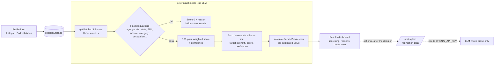

<div align="center">


<br>

<a href="https://v0-yojana-saarthi.vercel.app/"></a>


<br><br>

**Tell it who you are. It tells you which government schemes you can actually claim, and shows its arithmetic.**

</div>


## Why this exists

India runs a very large number of central and state welfare schemes, each with its own eligibility rules, documents and portal. A citizen who qualifies for a pension, a scholarship or a housing subsidy often never finds out, because the information is scattered across departments and written for administrators.

YojanaSaarthi ("Saarthi" = guide) turns that maze into one short form. You enter a profile, and it returns the schemes you match, ranked, with a per-criterion score breakdown and plain-language reasons for every match and every miss.

The deliberate design choice: **eligibility is decided by deterministic, auditable code, not by a language model.** When the question is "does this person get a benefit or not", an answer you cannot trace is a liability. An LLM is used only *after* the decision, to explain results in friendly language, and it is optional.

## Key features

- **26 modeled schemes** (19 central, 7 Karnataka state) across pension, housing, agriculture, education, business, health, women, employment and social security, in [`lib/schemes.ts`](lib/schemes.ts). Each scheme carries structured eligibility rules, required documents, application steps and an official link.
- **Two-stage matching.** Hard disqualifiers (gender, age, state, BPL, pregnancy, rural, street vendor, artisan, head of household, income ceiling, category, occupation) remove ineligible schemes outright. Survivors get a 0-100 score.
- **Explainable scoring.** Every match returns a `breakdown` of `earned / max` points per criterion (occupation 20, income 15, goals 15, category 10, age 10, gender 10, BPL/rural 10, state 5, bonus 5) plus `matchReasons` and `missedReasons`.
- **Confidence score** kept separate from the match score, based on how many specific eligibility criteria the profile actually satisfied.
- **Benefit estimate that avoids double counting.** `calculateBenefitBreakdown` weights annual value by score tier and treats alternatives (for example, overlapping scholarships) as mutually exclusive, so the total is not inflated.
- **Validated multi-step profile form** using Zod, including cross-field conflict checks (for example, a non-female profile cannot be marked pregnant).
- **Trilingual UI**: English, Hindi and Kannada through `next-intl` (`/en`, `/hi`, `/kn`).
- **Optional AI layer** for a personalised explanation per scheme and a short action plan, via `/api/explain` and `/api/action-plan`. Inactive unless `OPENAI_API_KEY` is set.
- **Scheme library and discovery pages** for browsing without a profile.

## Architecture



The dotted path is the only place a model appears, and it receives the *already computed* score and reasons. It cannot change who qualifies.

## Design decisions and trade-offs

| Decision | Why | Trade-off |
|---|---|---|
| **No LLM in the eligibility decision** | Reproducible, testable, explainable; no hallucinated eligibility | Rules must be hand-authored and maintained per scheme |
| **Hard disqualifiers before scoring** | A scheme you cannot get should never appear with a "70% match" | Income is a range, so the check compares the range's lower bound to the ceiling and errs toward showing a borderline scheme |
| **Income captured as ranges, not exact figures** | Lower friction and less sensitive data collected | Coarser than an exact income check |
| **Profile kept in `sessionStorage`** | No account, no database, no stored personal data | Profile is lost when the tab closes |
| **LLM strictly optional and post-decision** | Core product works with zero API keys; endpoints return a clean 503 when unconfigured | AI explanations unavailable without a key |
| **Policy metadata per scheme** (`targetStrength`, `benefitType`, `isAdditive`, `incomeSensitivity`) | Ranking and benefit totals reflect policy intent, not just field matches | More data to curate |
| **Goal-aware ranking plus a few scheme-specific rules** (e.g. Stand Up India dual eligibility) | Mirrors real scheme conditions a flat rule table cannot express | Special cases live in code rather than pure data |

## Tech stack

| Layer | Technology |
|---|---|
| Framework | Next.js 16 (App Router), React 19, TypeScript |
| UI | Tailwind CSS 4, Radix UI / shadcn-style components, Recharts, Lucide |
| Validation | Zod, React Hook Form |
| i18n | next-intl (en, hi, kn) |
| Optional AI | Vercel AI SDK (`ai`, `@ai-sdk/openai`), model `openai/gpt-4o-mini` |
| Hosting | Vercel |

## Getting started

Requires Node 20.x (see `engines` in `package.json`). The repo ships both `pnpm-lock.yaml` and `package-lock.json`; `packageManager` is pinned to pnpm.

```bash
git clone https://github.com/tchxm/YojanaSaarthi.git
cd YojanaSaarthi
pnpm install        # or: npm install
pnpm dev            # or: npm run dev
```

Open <http://localhost:3000>; it redirects to a locale prefix such as `/en`.

### Environment variables

| Variable | Required | Purpose |
|---|---|---|
| `OPENAI_API_KEY` | No | Enables the AI explanation and action-plan endpoints. Without it they return HTTP 503 and the deterministic results still work. |

Put it in `.env.local` (all `.env*` files are git-ignored).

## Tests

`scripts/test-scenarios.js` runs **50 persona scenarios** (for example an urban OBC woman street vendor in Delhi) and checks that expected schemes match and forbidden ones are excluded.

```bash
npm run test:scenarios      # node scripts/test-scenarios.js
npm run check               # production build, then the scenarios
```

Result when run for this README: **50 scenarios, `TOTAL ISSUES FOUND: 0`**.

> Honest note: the script keeps its own inlined copy of the scoring logic and a 23-scheme subset rather than importing `lib/schemes.ts`. It validates the rule design, but the two copies must be kept in sync by hand. Importing the real module is on the roadmap.

## Screenshots


<!-- TODO(screenshots): capture these into docs/screenshots/ and link them here -->
- [ ] **TODO:** Multi-step profile form (mobile view)
- [ ] **TODO:** Results dashboard with per-criterion score breakdown
- [ ] **TODO:** Hindi and Kannada locales side by side
- [ ] **TODO:** AI explanation / action plan card

## Project structure

```
app/[locale]/                 localized pages: home, discover, results, schemes
app/api/explain/              optional LLM explanation endpoint
app/api/action-plan/          optional LLM action-plan endpoint
lib/schemes.ts                scheme data + eligibility, scoring, ranking, benefit math
lib/profile-schema.ts         Zod schemas for the profile form
lib/scheme-localizations.ts   Hindi / Kannada scheme text
messages/                     UI strings (en, hi, kn)
components/                   profile form, results dashboard, score ring, scheme cards
scripts/test-scenarios.js     50-scenario accuracy test
```

## Roadmap

- [ ] Make the scenario tests import the real `lib/schemes.ts` instead of a copy
- [ ] Add Tamil (a `ta` slot exists in the localization types; no Tamil UI messages yet)
- [ ] Expand beyond 26 schemes and beyond Karnataka state schemes
- [ ] Scheme data as versioned JSON with a source link and last-verified date per rule
- [ ] WhatsApp / SMS entry point for low-connectivity users
- [ ] Mobile app

## Built by

**Mohammed Afnan**, AI/ML student at REVA University.
[GitHub](https://github.com/tchxm) · [Portfolio](https://resume-afnan.vercel.app) · [LinkedIn](https://www.linkedin.com/in/mohammed-afnan-77a27a311)

Licensed under MIT.

> Eligibility results are informational. Always confirm criteria on the official scheme portal linked in each scheme before applying.


